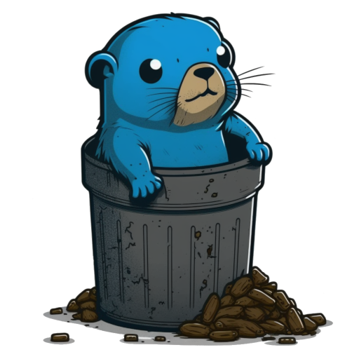

# Wastebasket

[](https://pkg.go.dev/github.com/Bios-Marcel/wastebasket)
[](https://github.com/Bios-Marcel/wastebasket/actions/workflows/test.yml)
[](https://codecov.io/gh/Bios-Marcel/wastebasket)

<p align="center">
  
</p>

Wastebasket is a go library / CLI tool allowing you to interact with your
system trashbin. It supports nix-systems (such as Linux and BSD) and Windows.

## v2

Note that `github.com/Bios-Marcel/wastebasket/v2` drops support for MacOS. I
simply can't be bothered maintaining it, as the performance is horrible and
adding features is hard to test. Additionally, a "proper" implementation
requires a very complex solution, embedding an objective C runtime.

If you need basic MacOS support, use `github.com/Bios-Marcel/wastebasket`.
This will limit you to trashing files and emptying the trashbin.

## Documentation

Further documentation can be found at [/docs](/docs).

## Dependencies

### Golang

The library supports at least the 3 latest major Golang versions. Depending on
your OS it might still work on an older version, but there are no guarantees.

### Windows

There are no dependencies, it depends on the Shell32 API built into Windows.

**No CGO required**

### Linux (Unix)

There are two (well, four) options you've got here. Wastebasket offers a native
golang implementation of the [FreeDesktop Trash specification](https://specifications.freedesktop.org/trash-spec/trashspec-latest.html).

Additionally, the custom implementation should also work for systems such
as BSD and its derivatives. However, this has not been tested and I do not
plan on doing so, simply because GitHub does not currently support running
tests on any BSD derivatives.

If anyone is willing to host a custom runner (which I think is possible), then
I'd be open to this though.

**No CGO required**

## Library usage

Grab it via

```bash
go get github.com/Bios-Marcel/wastebasket/v2
```

and you are ready to go.

Minimal Go example that creates a file, deletes it and empties the trashbin:

```go
package main

import (
    "fmt"
    "os"

    "github.com/Bios-Marcel/wastebasket/v2"
)

func main() {
    os.WriteFile("test.txt", []byte("Test"), os.ModePerm)
    fmt.Println(wastebasket.Trash("test.txt"))
    wastebasket.Empty()
}
```

## CLI usage

**UNSTABLE, USE AT YOUR OWN RISK**

Wastebasket can also be used as a commandline interface. You can build
executables for each subcommand (such as `empty`) separately, or build
`wastebasket` as a whole.

In order to do so, run

```shell
go build ./cmd/CMD
```

where `CMD` is whichever command you want to build.

### Autocompletion

The CLI offers autocompletion for flags and pre-defined arguments.

Bash; Write the following into your bash profile:

```bash
source <(wastebasket completion bash)
```

Additionally, completion is supported for zsh, powershell and fish.
For information, see [Cobra shell completions](https://github.com/spf13/cobra/blob/main/shell_completions.md)

## Tests

For windows, there is a utility that allows you to run linux or windows tests
using containers. This prevents the utilitiy from accidentally deleting files or
emptying your trashbin.

Simply execute:

```powershell
test <linux|windows>
```

Note that this doesn't work when you are on linux.

## Benchmarks

Run benchmarks using:

```go
go test -bench=.
```
